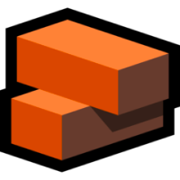
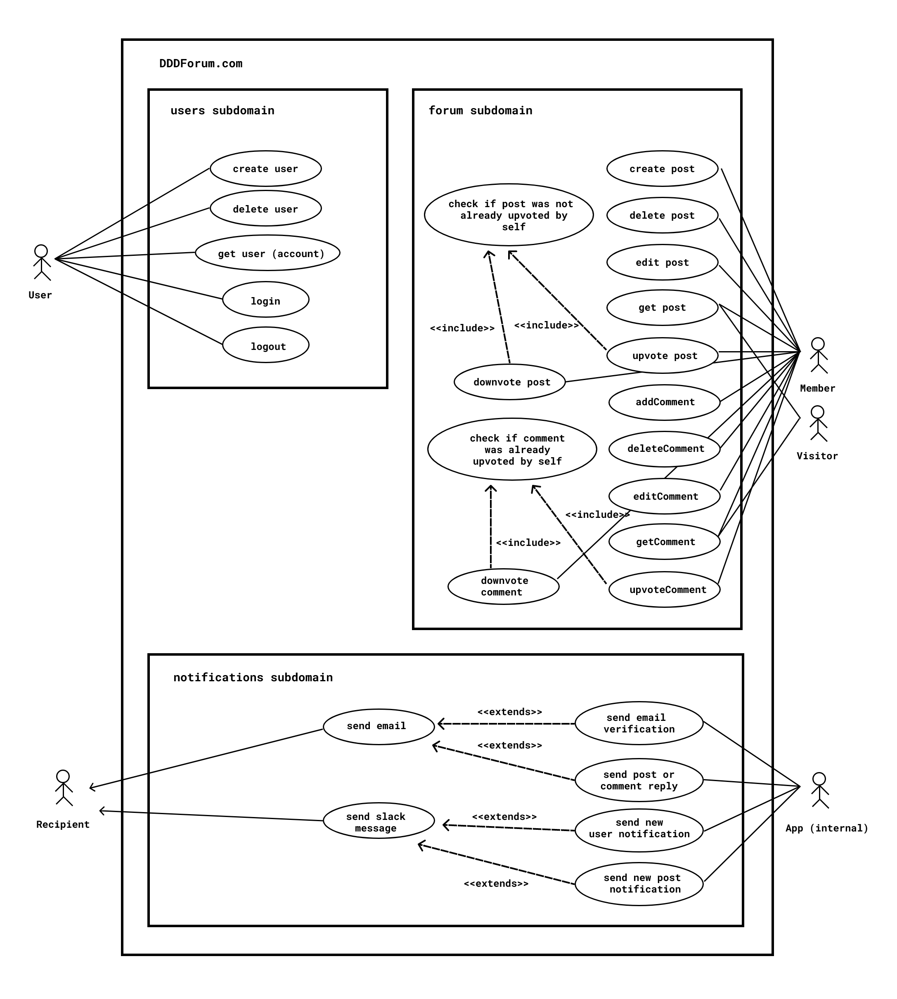

# DDDForum

Hacker news-inspired forum app built with TypeScript using Clean Architecture, SOLID principles, and DDD best practices from [solidbook.io](https://solidbook.io).

DDDForum is the application built in [solidbook.io - The Software Design and Architecture Handbook](https://solidbook.io).

[You can visit the demo site here](https://dddforum.com).

## Architecture

The app was built based on the Clean Architecture, SOLID principles, and Domain-Driven Design best practices using TypeScript.

### Clean architecture

The **Clean Architecture** is a way to separate the concerns of everything that goes into building complex enterprise applications. You'll never see any `infrastructure`-related code alongside `domain` layer code.

The Clean Architecture, when combined with Domain-Driven Design, is very powerful.

In DDD, we build applications on top of a number of **subdomains**.

### Use cases & actors

A *use case* is a high-level way to document behavior that an actor performs within a system.

An *actor* is a role played by either a specific type of user or a system itself (automations and external systems can be actors too — think payment processors like Stripe).

For instance, if the domain is a forum application, an actor might be a `member`, and some of their use cases might be to `createPost`, `postComment`, `upvotePost`, and `getPopularPosts`.

> Role matters. When identifying actors, name them based on their role.
> Identifying actors in our systems by thinking about their role helps us determine what their responsibilities are, and more importantly, what they're not.

All applications can be thought of as a grouping of use cases. That's all apps are anyways.

### Boundaries and Subdomains

**Boundaries** are a logical surface area where every construct is in the same context.
In Domain-Driven Design, the concept of **subdomains** is equivalent to a good way to represent the architectural boundaries, and the use cases that belong to those boundaries within our system(s).

A **subdomain** is a cohesive unit of code that represents exactly one core concept and is responsible for a specific set of concerns in an application architecture.

We're going to organize all the `actors` and their `use cases` into subdomains.

In DDDForum, There is a `forum` subdomain, which appears to be our core subdomain that allows us to focus on `posts`, `comments`, `votes`, and such - an essential part of our application.
There's also a generic `users` subdomain which takes care of all of our identity and access management for `users`.
As well, the primary actor in the `forum` is the `member`, while the primary actor of the `users` subdomain is the `user`.
We might also have one more subdomain for `notifications`.

Each subdomain has a:

- `domain` layer: where the highest-level policy, domain objects, and domain rules belong (`user`, `email`, etc)
- `application` layer: where the use cases / features that utilize domain objects belong (`createUser`, `login`, etc)
- `adapter` layer: where we define abstractions so that `application` layer code can interact with `infrastructure` layer concepts, without actually requiring on `infrastructure` (because that would break the [dependency rule](https://khalilstemmler.com/wiki/dependency-rule/)). Here we write things like `IUserRepo` - repository adapter, `IJWTTokenService` - an abstraction of a cache (redis) that manages tokens, etc.
- `infrastructure` layer: where we create [concrete](https://khalilstemmler.com/wiki/concrete-class/) implementations of the abstractions from the `adapter` layer so that they can be spun up at runtime thanks to the power of polymorhpism.

Some actual concepts that exist in each subdomain:

#### `users` subdomain

In the` users` subdomain, we're only concerned with concepts that are related to authentication, roles, etc. Here are a few examples of classes and concepts that exist at each layer.

- `domain` layer: `user` ([aggregate root](https://khalilstemmler.com/articles/typescript-domain-driven-design/aggregate-design-persistence/)), `userEmail` ([value object](https://khalilstemmler.com/articles/typescript-value-object/)), `userCreated` ([domain event](https://khalilstemmler.com/articles/typescript-domain-driven-design/chain-business-logic-domain-events/)).
- `application` layer: `createUserUseCase` ([use case](https://khalilstemmler.com/articles/enterprise-typescript-nodejs/application-layer-use-cases/)), `getUserByUserName` (use case).
- `adapter` layer: `IUserRepo` ([respository](https://khalilstemmler.com/articles/typescript-domain-driven-design/repository-dto-mapper/) interface adapter)
- `infrastructure` layer: `SequelizeUserRepo` (a concrete implementation of the IUserRepo), `UserDTO` ([data transmission objects](https://khalilstemmler.com/articles/typescript-domain-driven-design/repository-dto-mapper/)).

#### `forum` subdomain

In the `forum` subdomain, we're only concerned with concepts that have to do with building a forum. You won't see any domain concepts from the `user` in `forum`. In the `forum` subdomain, the concept most equivalent to a `user`, is a `member`.

Here are a few examples of concepts from the `forum` subdomain.

- `domain` layer: `member`, `comment`, `post`, `postVote`, `commentVote`, `commentVotesChanged`
- `application` layer: `replyToComment`, `getMemberByUserName`,  `upvotePost`, `downvotePost`
- `adapter` layer: `ICommentRepo`, `IPostRepo`, `IMemberRepo`
- `infrastructure` layer: `SequelizeCommentRepo`, `SequelizePostRepo`, `SequelizeMemberRepo`

Here's the use case diagram of DDDForum.

> While we could call everyone a `User`, that could be unproductive to the ubiquitous language.
> There is a time and place to call a user a `User`, such as in an Identity & Access Management / Authentication context.
> We should now understand that the `register` and `log in` use cases are not significant to a `Member` or `Visitor`, but they are significant to a `User`.
