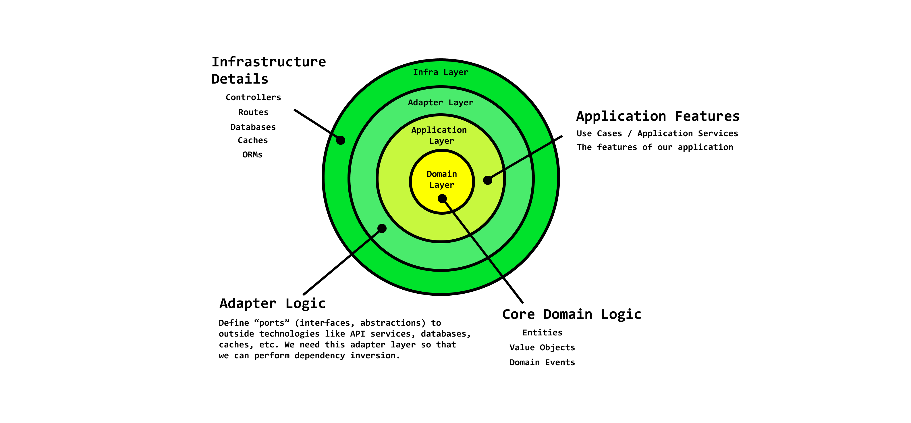
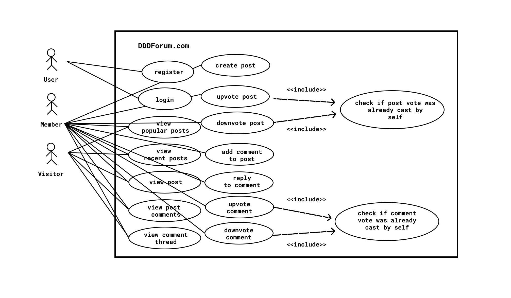
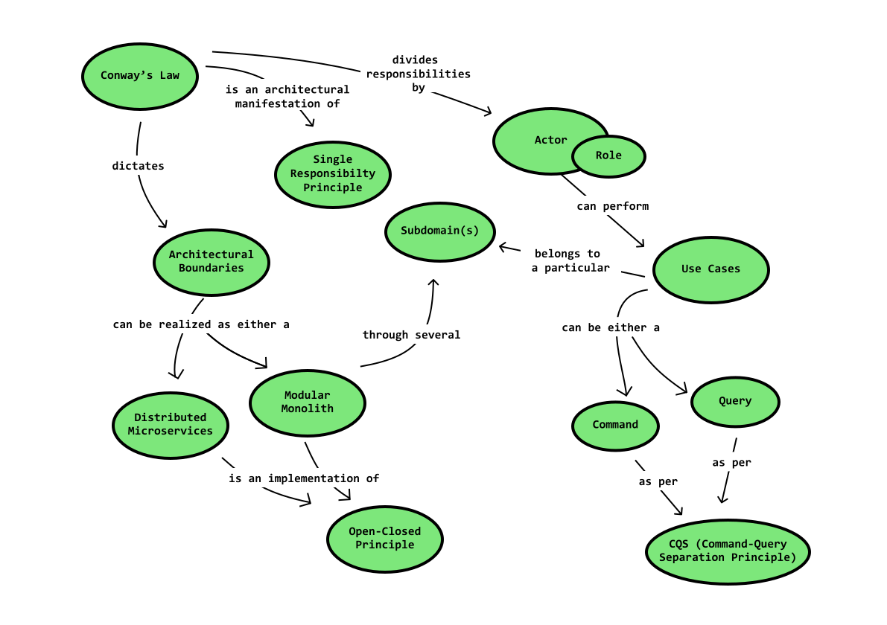
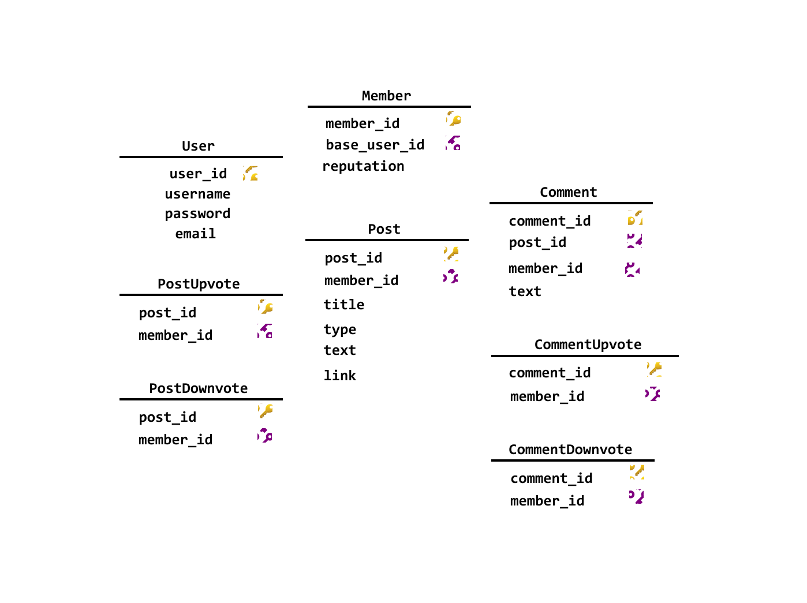
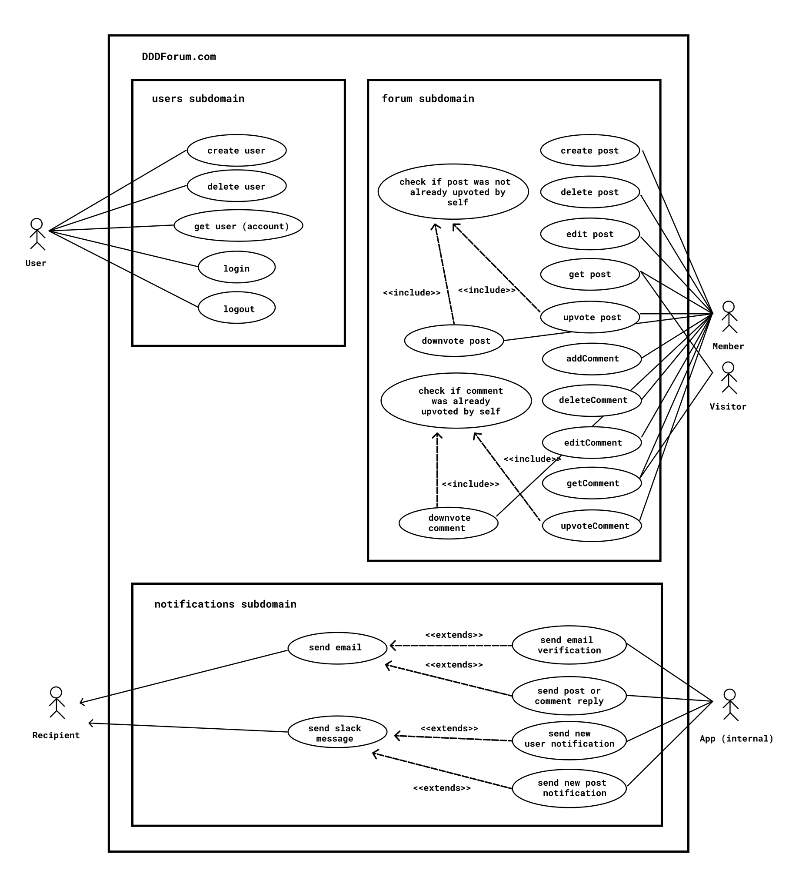

<h1 align="center">DDDForum</h1>

<p align="center">
 
</p>

Hacker news-inspired forum app built with TypeScript using Clean Architecture, SOLID principles, and DDD best practices from [solidbook.io](https://solidbook.io).

DDDForum is the application built in [solidbook.io - The Software Design and Architecture Handbook](https://solidbook.io).


[You can visit the demo site here](https://dddforum.com).

## Architecture

The app was built based on the Clean Architecture, SOLID principles, and Domain-Driven Design best practices using TypeScript.

### Clean architecture

The **Clean Architecture** is a way to separate the concerns of everything that goes into building complex enterprise applications. You'll never see any `infrastructure`-related code alongside `domain` layer code.



The Clean Architecture, when combined with Domain-Driven Design, is very powerful.
Using Domain-Driven Design patterns means that we're going to start our development journey by encoding the business rules within our domain models. The task is to define all the models, the relationships between them, the policies that govern when and how they can change, and make it virtually impossible to represent any illegal state.

Domain objects have zero dependencies and only create source code dependencies to other domain objects. Because of this, we can write tests to ensure that the business logic contained in entities, value objects, and domain services are correct, and we can expect these tests to run very fast.

It's challenging to implement Domain-Driven Design without some sort of Layered Architecture, as we need a way to isolate our domain layer from outer layer concerns like databases, controllers, web servers, etc.

Some references:

- [SOLID Principles](https://khalilstemmler.com/articles/solid-principles/solid-typescript)
- [SOLID Relevance](https://blog.cleancoder.com/uncle-bob/2020/10/18/Solid-Relevance.html)
- [The Clean Architecture](https://blog.cleancoder.com/uncle-bob/2012/08/13/the-clean-architecture.html)
- [Clean Node.js Architecture + TypeScript](https://khalilstemmler.com/articles/enterprise-typescript-nodejs/clean-nodejs-architecture)
- [Organizing App Logic with the Clean Architecture](https://khalilstemmler.com/articles/software-design-architecture/organizing-app-logic)
- [Flexible Error Handling](https://khalilstemmler.com/articles/enterprise-typescript-nodejs/handling-errors-result-class)
- [Functional Error Handling](https://khalilstemmler.com/articles/enterprise-typescript-nodejs/functional-error-handling)

### Domain-Driven Design

Domain-Driven Design is the approach to software development which enables us to translate complex problem domains into rich, expressive and evolving software.

References:

- [Domain-Driven Design](https://martinfowler.com/bliki/DomainDrivenDesign.html)
- [An Introduction to Domain-Driven Design](https://khalilstemmler.com/articles/domain-driven-design-intro)
- [Entities](https://khalilstemmler.com/articles/typescript-domain-driven-design/entities)
- [Value Objects](https://khalilstemmler.com/articles/typescript-value-object)
- [DTOs](https://khalilstemmler.com/articles/enterprise-typescript-nodejs/use-dtos-to-enforce-a-layer-of-indirection)
- [Implementing DTOs, Mappers & the Repository Pattern](https://khalilstemmler.com/articles/typescript-domain-driven-design/repository-dto-mapper)
- [Aggregates](https://khalilstemmler.com/articles/typescript-domain-driven-design/aggregate-design-persistence)
- [Challenges in Aggregate Design](https://khalilstemmler.com/articles/typescript-domain-driven-design/domain-modeling-1)
- [Handling Collections in Aggregates](https://khalilstemmler.com/articles/typescript-domain-driven-design/one-to-many-performance)
- [How to Handle Updates on Aggregates](https://khalilstemmler.com/articles/typescript-domain-driven-design/updating-aggregates-in-domain-driven-design)
- [Event-Based Systems](https://khalilstemmler.com/articles/enterprise-typescript-nodejs/why-event-based-systems)
- [Domain Events](https://khalilstemmler.com/blogs/domain-driven-design/where-do-domain-events-get-dispatched)
- [Decoupling Logic with Domain Events](https://khalilstemmler.com/articles/typescript-domain-driven-design/chain-business-logic-domain-events)
- [Use Cases](https://khalilstemmler.com/articles/enterprise-typescript-nodejs/application-layer-use-cases)

## Planning the project

### Use-case driven design

Being use-case driven helps to make better estimates, write more direct and intentional code, and plan out the tests. It is the best way to spend no more time on a project than is necessary (knowing what dictates a project being functionally complete).
All applications can be thought of as a grouping of use cases. That's all apps are anyways.

A *use case* is a high-level way to document behavior that an actor performs within a system.

An *actor* is a role played by either a specific type of user or a system itself (automations and external systems can be actors too — think payment processors like Stripe).

For instance, if the domain is a forum application, an actor might be a `member`, and some of their use cases might be to `createPost`, `postComment`, `upvotePost`, and `getPopularPosts`.

> Role matters. When identifying actors, name them based on their role.
> Identifying actors in our systems by thinking about their role helps us determine what their responsibilities are, and more importantly, what they're not.

All applications can be thought of as a grouping of use cases. That's all apps are anyways.

> Use cases should follow the CQS (Command-Query Separation) principle: every operation should be either a command (something that changes the system) or a query (something that returns data from the system), but never both.
> Instead of design a user case like `createAndReturnPost` we'd ensure two separate code paths for writes and reads by designing `createPost` (the command) and `getPostById` (the query).

#### Use-case artifacts

##### Use case diagrams

Diagrams help to understand at a high-level what systems, actors, and use cases exist.

##### Use case reports

Reports can contain more details, they document the **functional requirements** and how the system should respond to different scenarios when the **preconditions** change.

In addition to documenting our use case itself, we can utilize preconditions and postconditions to document business logic and how the system should respond in various scenarios (Given-When-Then).
This is often enough information to translate it directly into failing BDD-style unit tests, and then write the code to make the tests pass.

For example:
> "Given an existing post that the member hasn't yet upvoted, when they upvote it, then the post's score should increase by one"

**Use case name:** Upvote Post.

**Precondition(s):** A Member exists. A Post created by a different member also exists. The Member hasn't yet upvoted the Post.

**Postcondition(s):** The Posts score increased by one.

A failing test case:
```typescript
let post: Post;
let member: Member;
let postService: PostService;
let existingPostVotes: PostVote[];

describe("A post the member hasn't upvoted", () => {
  beforeEach (() => {
    post = null;
    member = null;
    existingPostVotes = [];
  })

  it ("When upvoted, it should upvote the post's score by one", () => {
    // Start out with a failing test.
    let initialScore: number;
    post = Post.create(...);
    initialScore = post.score;
    member = Member.create(...);
    postService.upvotePost(existingPostVotes, member, post);

    // Should fail since we haven't written any logic yet
    expect(post.score).toEqual(initialScore + 1);
    expect(post.votes.getNewItems().length).toEqual(1)
  })
})
```

##### Steps to implement use cases

1. Identify the roles of the actors using the system.
   - For this app, we could start by identifying the roles: `Members`, `Visitors`, and `Admin`.
2. Understand their end goal(s).
   - The goal for someone interested in DDD might be that they "want a place to learn about DDD and get their questions answered" (that's a common goal for `Visitors` and `Members`).
   - For `Admin` users, their goal is to "ensure that the DDDForum community is welcoming, helpful, and respectful".
3. Identify the system(s) that need to be constructed in order to enable the actor(s) to meet their goals.
   - For example, a marketplace, an admin panel, a blog, a forum, a social network, etc.
   - In the DDDForum app, we'll start with a forum site for `Members` and `Visitors`.
   - For `Admin` users, the admin panel could exist to serve their moderation needs.
4. For each actor in each system, list out all the use cases involved in helping that actor meet their goal(s).

> [UML Use Case Diagram Tutorial](https://www.youtube.com/watch?v=zid-MVo7M-E&ab_channel=Lucidchart)

### Subdomains and Bounded Contexts

The biggest problem with use case diagrams is the lack of being able to represent architectural boundaries.
Using the Use Case format, it's challenging to do it in a way that does not become messy. Like this use case diagram without a good separation of concerns:



What we need is a good way to represent the architectural boundaries and the use cases that belong to those boundaries within our system(s).
In Domain-Driven Design, the concept of **subdomains** is equivalent to these boundaries.

A **subdomain** is a cohesive unit of code that represents exactly one core concept and is responsible for a specific set of concerns in an application architecture. It is a smaller piece (logical boundary) within the entire problem space. Logically organizing code into subdomains is the first step, Bounded Contexts are what we actually deploy.

**Boundaries** is a logical boundary around all the subdomains needed in order for an application achieve its goals. We have two options for realizing our Bounded Contexts: Modular Monoliths and Distributed Micro-services.

In this case, we'll be using Modular Monoliths.

A Modular Monolith application is just a single Bounded Context with several Subdomains within it.
Each of the Subdomains for a one Bounded Context live within a single deployable unit.
If needed, we can break Subdomains into their own Bounded Contexts so that they can be managed and deployed as Distributed Micro-services.

> On new projects with a smaller team, it could be a good idea to start with a Modular Monolith instead of jumping to implementing Micro-services right away.

A monolithic application enables both the `Users` and `Forum` subdomains to live within the same codebase but from within separate modules.

In DDD, the way that subdomains or bounded contexts communicate with each other is through the publishing and subscribing of Domain Events.
In this project, we'll implement an In-Memory Domain Events Queue.

> Using Domain Events as the primary mechanism for messaging is an excellent way to foster loose coupling between modules.

> In a real-world micro-service deployment, Domain Events get published to a queue and sent out across the network to subscribers.

To discover the subdomains, all we have to do is think about the different teams that we could assemble to take ownership over a specific part of the business.
And if we know the teams (`subdomains` like `users`, `forum`, `notifications`), then every domain concept like an actor/role (and their use cases) belongs to a subdomain. We're going to organize all the `actors` and their `use cases` into subdomains.


In 1967, Melvin Conway, a computer scientist, was credited with the following quote with respect to designing systems:
> "Organizations which design systems are constrained to produce designs which are copies of the communication structures of these organizations".

Conway's law dictates architectural boundaries, which informs architects how to split an application into either distributed micro-services (micro-services split up and networked together) or a modular monolith (several subdomains well-separated within one deployable unit of code).

Here's an illustration of the influence Conway's Law has on architecture:



In DDDForum, There is a `forum` subdomain, which appears to be our core subdomain that allows us to focus on `posts`, `comments`, `votes`, and such - an essential part of our application.
There's also a generic `users` subdomain which takes care of all of our identity and access management for `users`.
As well, the primary actor in the `forum` is the `member`, while the primary actor of the `users` subdomain is the `user`.
We might also have one more subdomain for `notifications`.


Each subdomain has a:

- `domain` layer: where the highest-level policy, domain objects, and domain rules belong (`user`, `email`, etc)
- `application` layer: where the use cases / features that utilize domain objects belong (`createUser`, `login`, etc)
- `adapter` layer: where we define abstractions so that `application` layer code can interact with `infrastructure` layer concepts, without actually requiring on `infrastructure` (because that would break the dependency rule). Here we write things like `IUserRepo` - repository adapter, `IJWTTokenService` - an abstraction of a cache (redis) that manages tokens, etc.
- `infrastructure` layer: where we create concrete implementations of the abstractions from the `adapter` layer so that they can be spun up at runtime thanks to the power of polymorphism.

Some actual concepts that exist in each subdomain:

#### `users` subdomain

In the` users` subdomain, we're only concerned with concepts that are related to authentication, roles, etc. Here are a few examples of classes and concepts that exist at each layer.

- `domain` layer: `user` (aggregate root), `userEmail` (value object), `userCreated` (domain event).
- `application` layer: `createUserUseCase` (use case), `getUserByUserName` (use case).
- `adapter` layer: `IUserRepo` (repository interface adapter).
- `infrastructure` layer: `SequelizeUserRepo` (a concrete implementation of the IUserRepo), `UserDTO` (data transmission objects).

#### `forum` subdomain

In the `forum` subdomain, we're only concerned with concepts that have to do with building a forum. You won't see any domain concepts from the `user` in `forum`. In the `forum` subdomain, the concept most equivalent to a `user`, is a `member`.

Here are a few examples of concepts from the `forum` subdomain.

- `domain` layer: `member`, `comment`, `post`, `postVote`, `commentVote`, `commentVotesChanged`
- `application` layer: `replyToComment`, `getMemberByUserName`,  `upvotePost`, `downvotePost`
- `adapter` layer: `ICommentRepo`, `IPostRepo`, `IMemberRepo`
- `infrastructure` layer: `SequelizeCommentRepo`, `SequelizePostRepo`, `SequelizeMemberRepo`

We're also going to use CQRS (Command Query Response Segregation).
Taking it one step further than the CQS (Command-Query Separation) pattern, CQRS implies that we have separate models for reading and writing.
That is, for a `Post` aggregate, we have one write model and at least one read model opposed to having only one model responsible for both operations.

Here's the database schema of DDDForum:

> We're going to leave out the admin and admin panel for now.



And here's the use case diagram:



While we could call everyone a `User`, that could be unproductive to the ubiquitous language. There is a time and place to call a user a `User`, such as in an Identity & Access Management / Authentication context.

**Role matters.** We should now understand that the `register` and `log in` use cases are not significant to a `Member` or `Visitor`, but they are significant to a `User`.

- [Software Design with Application Layer Use Cases](https://khalilstemmler.com/articles/enterprise-typescript-nodejs/application-layer-use-cases/)

### Some other approaches to planning a project and exploring complex business domains

#### Event Storming

Using use case diagrams is appropriate when we understand the domain, and we're ok with doing the majority of the use case modeling work in isolation, away from domain experts.

However, it can be risky for developers to spend design time alone since we know that it's the initial design of a project that has the potential to have the most profound impact on the overall quality of the system.
There must be a design tool that involves both the developers and the domain experts in this process.
There is, and it's called Event Storming.

Event Storming is a group or workshop-based modeling technique that brings stakeholders and developers together in order to understand the domain quickly.

- [Event Storming](https://khalilstemmler.com/articles/graphql/ddd/schema-design/#Event-Storming)
- [Event Storming 101](https://www.lucidchart.com/blog/ddd-event-storming)

#### Event Modeling

It's more of a formalization of all the knowledge from 2003-2018 revolving around DDD and event-based systems.

- [Event Modeling](https://eventmodeling.org)

### Some useful information to have before starting a project includes

- An Event Stormed model created that identified all the events, commands, queries, aggregates, and views.
- Several of the policies/business rules thought out and identified that would affect how and when specific commands and events occur.
- Wireframes created with Figma to verify the exact attributes that we'd need on each model.
